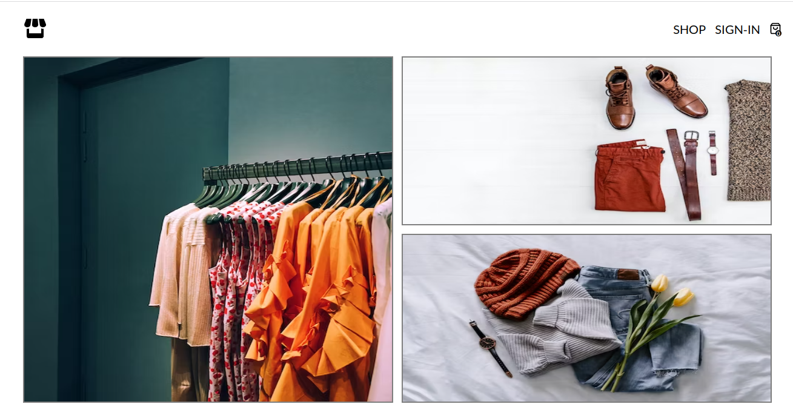
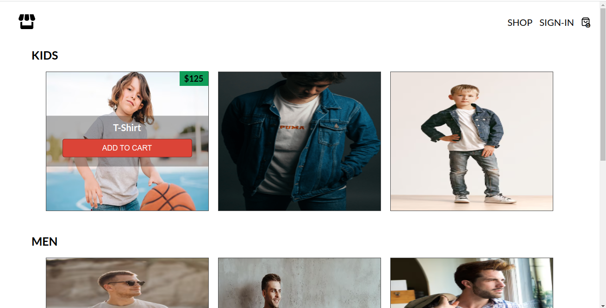
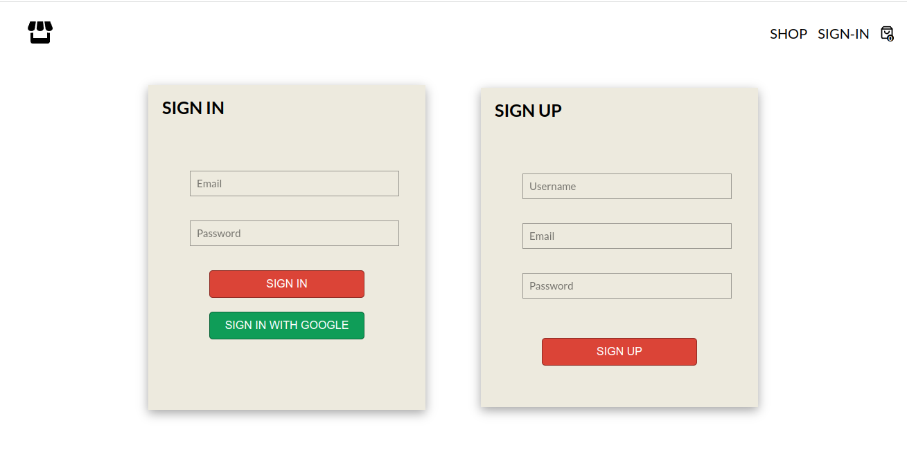
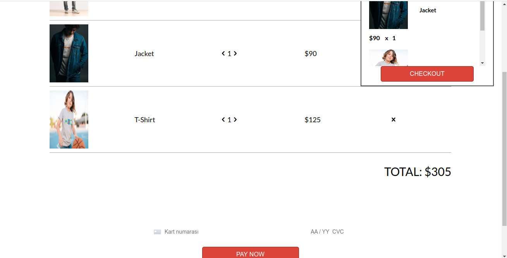

# [React E-commerce Website](https://ubiquitous-moxie-d5e9f8.netlify.app/)

|           Main           |           Shop           |
| :----------------------: | :----------------------: |
|  |  |

|           User           |           Checkout           |
| :----------------------: | :--------------------------: |
|  |  |

Amazing e-commerce website buid with react and firebase.

## Links:

- [Live Preview](https://ubiquitous-moxie-d5e9f8.netlify.app/)

## Installation

- Clone the repo:

```
git clone git@github.com:greatAlhazen/e-commerce-react.git
```

- Get into main directory and execute this command

```
yarn
```

- In the main directory create .env file and specify these

```
REACT_APP_FIREBASE_API_KEY: <YOUR_FIREBASE_API_KEY>
REACT_APP_FIREBASE_APP_ID: <YOUR_FIREBASE_APP_ID>
```

- After,get into terminal and execute this command for preview

```
yarn start
```

- After those get into browser and go to specified http://localhost:3000

## For stripe payment

- Before, install netlify-cli your machine with this command

```
npm install -g netlify-cli
```

- Get into main directory .env file and specify these

```
REACT_APP_STRIPE_PUBLISHABLE_KEY: <YOUR_MONGO_STRIPE_PUBLISHABLE_KEY>
STRIPE_SECRET_KEY: <YOUR_STRIPE_SECRET_KEY>
```

- After,specify these commands in order

```
netlify login
netlify dev
```

## Copyright

Copyright 2023 [Enes Uraz](https://github.com/greatAlhazen)
